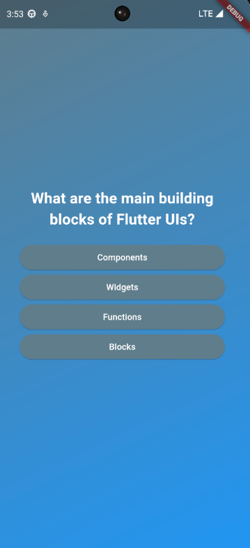
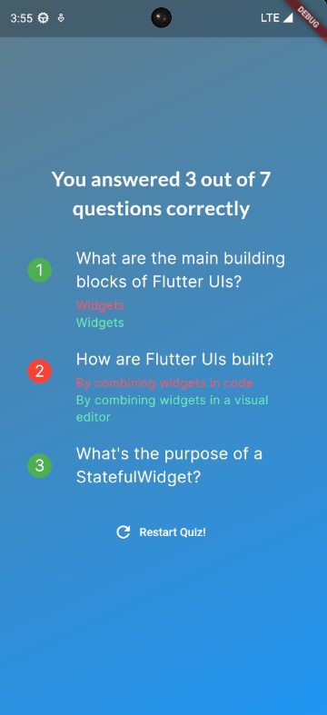

# Quiz_app

A new Flutter project.

## Getting Started

This just a simple quiz app built with the Flutter Framework, and the Dart language, the code is not 100% consist because i just sticking around and playing with some concepts.

The quiz app first Screen, with that screen i've learn how to import images in flutter and work with the pubspec.yalm file, and also learn how to change between screen content's, using some core concepts like StatfulWidgtes and StatlessWidgets.

## Second Screen

With that screen i can learn how to manipulate the Widget's and Widget's format's and how the parents can affect his childrens Widgets, i've also learn some MVC concept's to play around with data in a dinamyc and consistant way.

Last, but not least, the result Screen who's have an ScroolView, that screen allows the use see your answer's, in green and the correct answer in red, also show you the answer index and if it's wrong or correct. Besides, the user can restart the Quiz again. 

So, that's a very simple flutter project but very interestring to work with some core concepts and stick around about the framework workflow and Widget's behaviours.